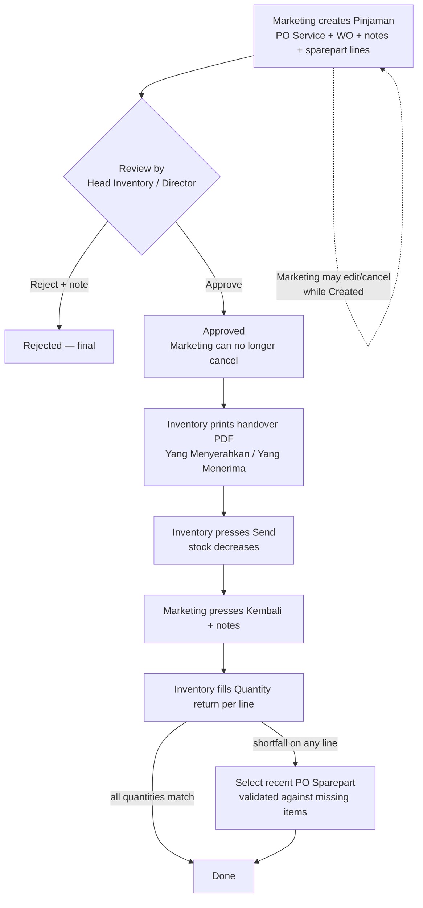

# Pinjaman (Borrow) Redesign

## Problem Frame

The current Borrow feature (shipped 2026-06-09, branch `borrow-backend`, not in
production) is a self-contained inventory tool: Inventory roles create a borrow
with a free-text borrower name, stock moves on Borrow/Return, returns are
all-or-nothing. The business actually wants Pinjaman to be a **Marketing-driven
request tied to a Service Purchase Order**, with a review/approval step, a
signed physical handover, partial returns, and reconciliation of any shortfall
against a Sparepart PO (shortfall = items sold). This redesign replaces the
current lifecycle and ownership model.

## User Flow

Statuses: `Created → Approved → Borrowed → Returned → Done`, with terminal
side-exits `Rejected` (by reviewer) and `Cancelled` (by Marketing, only while
`Created`).

## Requirements

**Creation (Marketing)**
- R1. Marketing creates a Pinjaman; it must reference a PO of type **Service**
  (the customer `po_number` obtained at Quotation moveToPo) and the Work Order
  belonging to that PO, plus mandatory notes.
- R2. The PO Service field is a searchable option list: type-to-search and
  load-more over recent Service POs. The WO is shown/confirmed from the chosen
  PO (data model has one WO per PO — see Key Decisions).
- R3. The sparepart form mirrors the Return PO page layout: rows of sparepart
  (searchable), borrow quantity, and a **Quantity return** column that is
  read-only/empty at creation and filled later at reconciliation.
- R4. Marketing can edit and cancel its own Pinjaman only while status is
  `Created`.

**Review (Head Inventory / Director)**
- R5. The existing **Head Inventory** role (and Director) reviews a `Created`
  request and either approves or rejects it with a note. Rejection is final.
- R6. Once approved, Marketing can no longer cancel or edit the request.

**Handover (Inventory)**
- R7. On an `Approved` Pinjaman, Inventory can press **Print PDF**: a handover
  form showing "Yang Menyerahkan <logged-in user name>" and
  "Yang Menerima <name entered manually at print time>". Printing does not
  change status and may be repeated.
- R8. Inventory presses **Send** to confirm the signed physical handover.
  Send decreases branch stock by the borrow quantities (all-or-nothing stock
  check, recorded in the Stock History ledger) and moves status to `Borrowed`.

**Return & reconciliation**
- R9. Marketing presses **Kembali** on a `Borrowed` Pinjaman and must enter
  closing notes; status moves to `Returned`.
- R10. Inventory then fills the actual **Quantity return** per sparepart line
  (0 ≤ returned ≤ borrowed). Returned quantities restock the branch via the
  stock ledger.
- R11. If any line has returned < borrowed (shortfall = sold), Inventory must
  select a recent **PO Sparepart** from a searchable, load-more option list.
  The selected PO is validated: it must contain the missing spareparts in at
  least the shortfall quantities; otherwise Done is blocked.
- R12. Inventory presses **Done** to finish: quantities (and PO Sparepart link
  when required) are saved, stock adjustments applied, status becomes `Done`.

**Roles & access**
- R13. Marketing gains access to the Pinjaman feature (list, create, edit,
  cancel, Kembali). Inventory roles keep their access (Print PDF, Send,
  reconciliation, Done). Head Inventory and Director additionally approve or
  reject. Director retains its global bypass.
- R14. Buttons are gated by both status and role (e.g. Kembali only for
  Marketing on `Borrowed`; Send only for Inventory on `Approved`).

## Success Criteria

- A Marketing user can complete the full happy path (create → approved → PDF →
  Send → Kembali → reconcile → Done) with stock visibly decreasing at Send and
  increasing by the returned amounts, both visible in Stock History.
- A shortfall return cannot reach `Done` without a valid PO Sparepart whose
  contents cover the missing items.
- An approved request can no longer be cancelled by Marketing.
- The printed PDF carries both handover names.

## Scope Boundaries

- No automatic creation or mutation of the Sparepart PO at reconciliation —
  the link is a validated reference; the shortfall simply remains deducted
  from stock (it was sold).
- No new approval-notification system (in-app/email) — review is discovered by
  visiting the page, like other BMJ approval flows.
- No preservation of the June 9 borrow schema/data — rework migrations in
  place (feature never reached production).
- Old `borrower_name` free-text flow is removed, replaced by the PO/WO link.

## Key Decisions

- **Reuse "Head Inventory"**: the role already exists in both repos with
  borrow access; no new role string is introduced (the request's "Head of
  Inventory" maps to it).
- **Stock decreases at Send, not at approval**: Send represents the signed
  physical handover, pressed by Inventory after printing the PDF.
- **Quantity return filled at reconciliation by Inventory**, not at creation
  by Marketing; Marketing's Kembali only declares the return with notes.
- **PO Sparepart link validates quantities**: blocking Done when the selected
  PO does not cover the shortfall, rather than being a free reference.
- **Rework in place**: existing borrow migrations/controller are edited
  directly; no additive alter-migrations.
- **WO auto-derived from PO**: the data model is one Work Order per Purchase
  Order (`hasOne`), so after choosing the Service PO the WO is displayed for
  confirmation rather than independently searched.

## Dependencies / Assumptions

- All stock mutations continue to flow through `SparepartStockService` so the
  Stock History ledger stays correct (`reference_type='Borrow'`).
- PDF remains frontend-generated (pdfmake), consistent with every other BMJ
  document; the print-time name input reuses the existing modal-before-print
  pattern.
- The frontend e2e specs for borrow and stock history will need rewriting to
  the new lifecycle.

## Outstanding Questions

### Resolve Before Planning
- (none)

### Deferred to Planning
- [Affects R2/R11][Technical] Exact API shape for the searchable + load-more
  lists (Service POs, PO Spareparts): reuse `GET /purchase-order?search&page`
  with a type filter, or dedicated lightweight endpoints.
- [Affects R8/R10][Technical] Whether Send and Done stock operations need the
  same lock-and-check pattern the current borrow/return actions use (they
  should; confirm against `SparepartStockService`).
- [Affects R13][Technical] Which route-middleware token lists change to admit
  `marketing`, and how the frontend `accessFeature` map and role menus pick up
  the borrow feature for Marketing.

## Next Steps
→ `/ce:plan` for structured implementation planning
