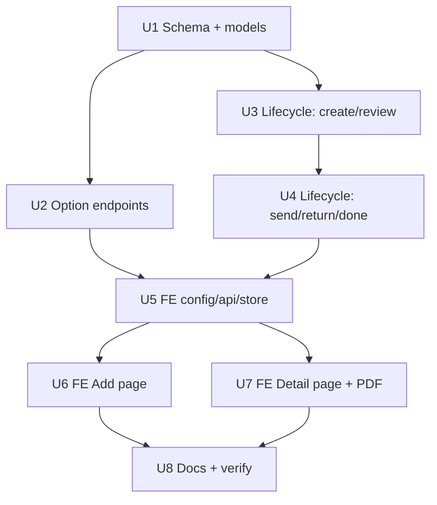

# feat: Redesign Pinjaman (Borrow) as Marketing-driven PO-linked lifecycle

## Overview

Replace the self-contained Borrow feature (Inventory-created, free-text
borrower, all-or-nothing return) with a Marketing-driven request tied to a
Service Purchase Order, reviewed by Head Inventory/Director, handed over via a
signed PDF + **Send** action, partially returned via **Kembali** + per-line
**Quantity return**, with shortfalls reconciled against a validated Sparepart
PO before **Done**. Spans both repos; backend owns the contract.

## Problem Frame

See origin doc. The June 9 implementation never reached production, so schema
and controller are reworked in place on branch `borrow-backend`.

## Requirements Trace

R1–R14 from the origin document (PO Service + WO link, searchable lists,
Return-PO-style form with Quantity return, edit/cancel while Created,
approve/reject by Head Inventory/Director, repeatable PDF with both handover
names, Send decreases stock, Kembali with notes, reconciliation with
0 ≤ returned ≤ borrowed, shortfall requires quantity-validated Sparepart PO,
Done applies restock, Marketing gains access, buttons gated by role+status).

## Scope Boundaries

(from origin) No Sparepart-PO mutation; no notifications; no schema/data
preservation; `borrower_name` flow removed. Additionally: e2e spec rewrite is
acknowledged but deferred to a follow-up task after the feature stabilizes
(the harness wipes/reseeds a sibling DB and the specs are serially fragile).

## Context & Research

### Relevant Code and Patterns

- `app/Http/Controllers/BorrowController.php` — current lifecycle, status
  trail (`appendStatus`), doc-number generator, branch resolution, the
  lock-and-check stock pattern in `borrow()` (lines ~189–241) to reuse for Send.
- `app/Services/SparepartStockService.php` — the only legal stock mutation
  path; keep `reference_type='Borrow'` so Stock History stays correct.
- `QuotationController::changeStatusToReturn` (~1788) — per-line
  `returned[].sparepart_id/quantity` payload shape; mirror for Done.
- `app/Models/PurchaseOrder.php` — `quotation` (type lives on quotation:
  `Service`|`Spareparts`), `workOrder` (hasOne), versioning (`latest('version')`
  needed to dedupe versions).
- `routes/api.php:177-187` — current borrow route group; RoleMiddleware token
  convention (`head_inventory`, Director bypass at RoleMiddleware.php:27).
- Frontend: `PurchaseOrderReturnPage.vue` (form layout to mirror),
  `QuotationForm.vue` per-row Bootstrap dropdown autocomplete (canonical
  search pattern; load-more is net-new), `ModalNotes.vue`/`stores/modal.js`
  (modal-before-print with extra text input), `src/utils/pdf/*.js` (pdfmake
  templates; `createdByName` stamping in quotation.js/purchase-order.js),
  `useRole.js` + `accessFeature` map in `src/config/index.js`.

### Institutional Learnings

- Memory `bmj-stock-rules`: per-branch stock only via SparepartStockService;
  lock on decrement.
- Memory `bmj-status-lifecycle`: two-field status (current_status + JSON
  trail), moveToX-style transitions, doc-number format.
- `docs/superpowers/specs/2026-06-09-borrow-and-stock-history-design.md` —
  superseded design; update or mark superseded in Unit 8.

## Key Technical Decisions

- **Dedicated option endpoints under `/borrow` prefix** for Service-PO and
  Sparepart-PO pickers: existing `GET /purchase-order` is gated
  `role:marketing,finance,director`; Inventory needs the Sparepart-PO list.
  Borrow-scoped endpoints avoid widening unrelated route permissions and
  return a lean payload (id, po_number, purchase_order_number, date,
  spareparts) filtered to latest version + quotation type.
- **Per-action route subgroups** instead of one role list: create/update/
  cancel/kembali = `marketing`; approve/reject = `head_inventory`; send/done =
  `inventory_admin,inventory_purchase,head_inventory`; list/detail = union.
  Director bypasses everywhere (middleware behavior).
- **`quantity_return` lives on `detail_borrows`** (nullable until Done);
  Sparepart-PO link is `sparepart_po_id` FK on `borrows` (nullable; required
  by validation only when a shortfall exists).
- **Stock timing**: decrease at Send (reuse lock-and-check all-or-nothing
  pattern), increase per returned line inside Done, both via
  SparepartStockService with `reference_type='Borrow'`.
- **WO display, not selection**: PO hasOne WorkOrder, so the detail/create
  payload embeds the PO's WO; no separate WO endpoint (see origin).
- **"Yang Menerima" name is transient** — passed to the pdfmake template at
  print time like other BMJ print-modal inputs, not persisted.
- **Statuses**: `Created → Approved → Borrowed → Returned → Done`, terminal
  `Rejected`, `Cancelled` (only from Created). `Borrowed` keeps its name so
  Stock History labels stay coherent.

## Open Questions

### Resolved During Planning

- Option-list API shape: dedicated `/borrow/options/*` endpoints (above).
- Lock pattern for Send/Done: yes — reuse the existing `lockForUpdate`
  ensureStockRecord flow from current `borrow()`.
- Middleware tokens: subgroups per action (above); frontend `accessFeature`
  gains `borrow` for `marketing`, and MarketingMenu gets the Borrow tile.

### Deferred to Implementation

- Exact pagination contract for load-more (Laravel paginator already returns
  `last_page`; the frontend appends pages — final param names settled in code).
- Whether `update` keeps delete-and-recreate for detail lines (current "BMJ
  pattern") — keep unless tests reveal a problem.

## Implementation Units

- [ ] **Unit 1: Backend schema and model rework**

**Goal:** Rework borrow tables in place for the new lifecycle.

**Requirements:** R1, R3, R10, R11

**Dependencies:** None

**Files:**
- Modify: `database/migrations/2026_06_09_100001_create_borrows.php`,
  `database/migrations/2026_06_09_100002_create_detail_borrows.php`
- Modify: `app/Models/Borrow.php`, `app/Models/DetailBorrow.php`
- Modify: `app/Models/PurchaseOrder.php` (inverse relation if needed)
- Test: `tests/Feature/BorrowSchemaTest.php` (minimal model/relation assertions)

**Approach:**
- `borrows`: drop `borrower_name`; add `purchase_order_id` FK (the Service
  PO), `sparepart_po_id` nullable FK (reconciliation PO), `return_notes`
  nullable text, `reject_notes` nullable text. Keep `borrow_number`,
  `branch_id`, `employee_id`, `notes`, `current_status`, `status` JSON.
- `detail_borrows`: add `quantity_return` nullable unsignedInteger.
- Relations: `Borrow belongsTo purchaseOrder`, `Borrow belongsTo sparepartPo
  (PurchaseOrder)`, existing `detailBorrows`/`branch`/`employee` kept.

**Patterns to follow:** existing borrow migrations; FK style in other
migrations (e.g. purchase_orders → quotations).

**Test scenarios:**
- Happy path: a Borrow can be created with a purchase_order_id and its
  `purchaseOrder.quotation.type` is readable; detailBorrows rows accept
  null `quantity_return`.
- Edge: deleting a borrow cascades detail rows (existing behavior preserved).

**Verification:** migrate:fresh succeeds; relation assertions pass.

- [ ] **Unit 2: Backend option-list endpoints (Service POs, Sparepart POs)**

**Goal:** Lean searchable + paginated PO lists for the two pickers.

**Requirements:** R2, R11

**Dependencies:** Unit 1 (none strictly, but ship together on routes)

**Files:**
- Modify: `app/Http/Controllers/BorrowController.php`
- Modify: `routes/api.php`
- Test: `tests/Feature/BorrowOptionsTest.php`

**Approach:**
- `GET /borrow/options/purchase-orders?type=Service|Spareparts&search=&page=`:
  latest-version POs whose `quotation.type` matches, `search` against
  `po_number`/`purchase_order_number`, ordered recent-first, Laravel
  pagination. Service responses embed the PO's `workOrder` summary; Spareparts
  responses embed quotation sparepart lines (id, name, number, quantity) for
  shortfall validation display.
- Route group accessible to `marketing,inventory_admin,inventory_purchase,head_inventory,director`.

**Patterns to follow:** `PurchaseOrderController::getAll` query/format style;
version dedupe via `latest('version')` grouping as done elsewhere.

**Test scenarios:**
- Happy path: type=Service returns only Service-quotation POs with embedded
  WO; type=Spareparts returns only Spareparts POs with line items.
- Happy path: `search=ABC` matches po_number substring; pagination returns
  `last_page`.
- Edge: PO with multiple versions appears once (latest version).
- Error path: missing/invalid `type` → 422.
- Auth: marketing and inventory tokens get 200; e.g. finance gets 403.

**Verification:** feature tests pass against seeded POs of both types.

- [ ] **Unit 3: Backend lifecycle — create, update, cancel, approve, reject**

**Goal:** Marketing creation linked to a Service PO; review step.

**Requirements:** R1, R4, R5, R6, R13

**Dependencies:** Unit 1

**Files:**
- Modify: `app/Http/Controllers/BorrowController.php`
- Modify: `routes/api.php` (subgrouped roles per Key Decisions)
- Test: `tests/Feature/BorrowLifecycleTest.php`

**Approach:**
- `store`/`update` payload: `{purchaseOrderId, notes (required),
  spareparts: [{sparepartId, quantity}]}`. Validate the PO exists, is latest
  version, and `quotation.type === 'Service'`. `update`/`cancel` only while
  `Created` and only by the creator (or Director).
- New `approve/{id}` and `reject/{id}` (reject requires `notes`): only from
  `Created`; append status trail entries; rejection terminal.
- Keep doc-number generator and `appendStatus` as-is.

**Execution note:** Implement test-first (Iron Law — harness exists; the
feature currently has zero backend tests).

**Patterns to follow:** current `store`/`update`/`cancel` in
BorrowController; status-guard style (`abort unless current_status === X`).

**Test scenarios:**
- Happy path: marketing creates with Service PO → 201, status Created, trail
  has one entry; response embeds PO + WO.
- Error path: PO of type Spareparts → 422; missing notes → 422.
- Happy path: head_inventory approves → Approved; director approves → Approved.
- Happy path: reject with notes → Rejected; reject without notes → 422.
- Error path: marketing cancel after approve → 403/409; cancel while Created → Cancelled.
- Error path: update after approval → 409; update by a different marketing
  user → 403.
- Auth: marketing cannot approve (403); inventory_admin cannot create (403).

**Verification:** all lifecycle tests green; no stock movement occurs in any
of these transitions.

- [ ] **Unit 4: Backend lifecycle — send, kembali, done (stock + reconciliation)**

**Goal:** Stock-bearing half of the lifecycle.

**Requirements:** R8, R9, R10, R11, R12

**Dependencies:** Units 1–3

**Files:**
- Modify: `app/Http/Controllers/BorrowController.php`
- Modify: `routes/api.php`
- Test: `tests/Feature/BorrowStockTest.php`

**Approach:**
- `send/{id}` (inventory roles): only from `Approved`; all-or-nothing stock
  check with `lockForUpdate`, then `stockService->decrease(...,'Borrow',id)`
  per line; status → `Borrowed`.
- `kembali/{id}` (marketing): only from `Borrowed`; requires `notes` →
  `return_notes`; status → `Returned`; no stock effect.
- `done/{id}` (inventory roles): only from `Returned`; payload
  `{returned: [{sparepartId, quantityReturn}], sparepartPoId?}`. Validate
  every detail line present, `0 ≤ quantityReturn ≤ quantity`. If any
  shortfall: `sparepartPoId` required, must reference a latest-version
  Spareparts-type PO whose lines cover each shortfall sparepart with
  `quantity ≥ shortfall`; else 422. Persist `quantity_return` per line +
  `sparepart_po_id`, `stockService->increase` per returned line (skip zero),
  status → `Done`.
- Replace old `borrow`/`returnItems` endpoints entirely.

**Execution note:** Test-first; reuse the transaction + lock shape from the
current `borrow()` implementation.

**Patterns to follow:** current `borrow()` stock block;
`changeStatusToReturn` payload validation style.

**Test scenarios:**
- Happy path: send on Approved decreases each branch stock by borrow qty and
  writes ledger rows; status Borrowed.
- Error path: send with insufficient stock on one line → 422, **no** partial
  decrement (all-or-nothing).
- Error path: send on Created (unapproved) → 409.
- Happy path: kembali with notes → Returned, return_notes saved, stock
  unchanged.
- Happy path: done with full return (all quantityReturn == quantity, no
  sparepartPoId) → stock restored to pre-send levels, status Done.
- Happy path: done with shortfall + valid Sparepart PO covering it → stock up
  by returned amounts only, sparepart_po_id saved, status Done.
- Error path: shortfall without sparepartPoId → 422.
- Error path: sparepartPoId pointing at Service-type PO → 422.
- Error path: Sparepart PO lacks the missing sparepart or has insufficient
  quantity → 422 and status stays Returned.
- Edge: quantityReturn > quantity or negative → 422; missing a detail line in
  payload → 422.
- Integration: full happy path Created→…→Done leaves Stock History ledger
  with one decrease set and one increase set, reference_type 'Borrow'.

**Verification:** stock assertions computed from BranchSparepart before/after;
ledger rows asserted via the stock movement table.

- [ ] **Unit 5: Frontend config, roles, api, store rework**

**Goal:** Wire the new contract and Marketing access into the FE foundation.

**Requirements:** R13, R14 (foundation for R1–R12 UI)

**Dependencies:** Units 2–4 (contract fixed)

**Files (frontend repo):**
- Modify: `src/config/index.js` (borrow statuses → new set; `accessFeature`
  marketing + borrow; api paths)
- Modify: `src/api/borrow.js` (approve/reject/send/kembali/done/cancel +
  options endpoints), `src/stores/borrow.js` (mapBorrow with PO/WO/quantity
  return/sparepart PO; actions; PO-options state with append-page load-more)
- Modify: `src/views/role/MarketingMenu.vue` (add MenuBorrow tile),
  `src/components/NavbarDesktop.vue` if feature-group mapping needs it
- Test expectation: none — no FE harness (VERIFIED-WITH-GAP per adapter);
  verified via `npm run build` + browser QA in Unit 8.

**Approach:** follow existing store mapXxx boundary; statuses
`Created/Approved/Borrowed/Returned/Done/Rejected/Cancelled` with badge
colors consistent with other modules.

**Patterns to follow:** `src/stores/purchase-order.js` mapping style;
`accessFeature` entries for `marketing`.

**Verification:** `npm run build` passes; marketing login shows Borrow tile.

- [ ] **Unit 6: Frontend BorrowAddPage rework (PO autocomplete + form)**

**Goal:** Marketing creation form per R1–R3.

**Requirements:** R1, R2, R3, R4

**Dependencies:** Unit 5

**Files (frontend repo):**
- Modify: `src/views/menu/BorrowAddPage.vue`
- Possibly create: `src/components/borrow/PoSelect.vue` (shared searchable +
  load-more dropdown, reused in Unit 7 for the Sparepart PO picker — extract
  on the second use per discipline; build it here since Unit 7 is the known
  second consumer)
- Test expectation: none — no FE harness; covered by build + browser QA.

**Approach:**
- PO Service picker: type-to-search (debounced, canonical QuotationForm
  dropdown pattern) + "Load more" appending next page; selecting a PO shows
  its WO (number/worker) read-only and stores `purchaseOrderId`.
- Sparepart rows mirror PurchaseOrderReturnPage layout: sparepart search,
  borrow quantity, disabled empty "Quantity return" column; notes required.
- Edit mode reuses the page while status Created.

**Patterns to follow:** `QuotationForm.vue` dropdown close/clear behavior
(per tests/QUOTATION_AUTOCOMPLETE_NOTES.md); `PurchaseOrderReturnPage.vue`
row layout and validations.

**Verification:** create + edit flows work in browser against local backend;
invalid states (no PO, no notes, qty ≤ 0) blocked client-side.

- [ ] **Unit 7: Frontend BorrowDetailPage rework (lifecycle buttons, reconciliation, PDF)**

**Goal:** Role+status-gated lifecycle UI, reconciliation form, handover PDF.

**Requirements:** R5–R12, R14

**Dependencies:** Units 5, 6

**Files (frontend repo):**
- Modify: `src/views/menu/BorrowDetailPage.vue`, `src/views/menu/BorrowPage.vue`
  (status badges/filters)
- Create: `src/utils/pdf/borrow.js`
- Modify: `src/stores/modal.js` / `ModalNotes.vue` only if the existing
  extra-input option can't carry the "Yang Menerima" field
- Test expectation: none — no FE harness; covered by build + browser QA.

**Approach:**
- Buttons via `useRole` + status: Approve/Reject (head_inventory/director on
  Created, reject opens notes modal), Edit/Cancel (marketing on Created),
  Print PDF + Send (inventory roles on Approved; Print also available later
  for reprint), Kembali (marketing on Borrowed, notes modal), reconciliation
  + Done (inventory roles on Returned).
- Reconciliation: Quantity return inputs become editable per line
  (0..borrowed); live shortfall indicator; when shortfall > 0 the Sparepart
  PO picker (PoSelect, type=Spareparts) appears and is required; submit calls
  done.
- PDF: pdfmake template modeled on delivery-note/back-order; signature block
  "Yang Menyerahkan <authStore user name>" / "Yang Menerima <modal input>";
  triggered through openNotesModal-style flow.

**Patterns to follow:** `QuotationDetailPage.vue` print-modal flow;
`src/utils/pdf/delivery-note.js` document structure; PurchaseOrderReturnPage
validation messages.

**Verification:** every transition reachable in browser with the right role,
hidden for the wrong role; PDF renders both names; Done blocked on uncovered
shortfall with a clear message.

- [ ] **Unit 8: Docs, drift cleanup, and end-to-end verification**

**Goal:** Documentation matches the shipped behavior; full-flow evidence.

**Requirements:** all (verification), success criteria from origin

**Dependencies:** Units 1–7

**Files:**
- Modify (backend): `docs/API_ROUTES.md`, `docs/CONTROLLERS.md`,
  `docs/MODELS.md`, `AGENTS.MD` (borrow section),
  `docs/superpowers/specs/2026-06-09-borrow-and-stock-history-design.md`
  (mark superseded, link new docs)
- Modify (frontend): `AGENTS.MD`, add `docs/FEATURE_BORROW.md` following the
  FEATURE_*.md template
- Test: full backend suite `php artisan test`; FE `npm run build`; gstack
  browser QA of the happy path + shortfall path with marketing,
  head_inventory, inventory_admin, director logins.

**Test scenarios:**
- Integration (browser): origin Success Criteria 1–4 demonstrated with
  screenshots, including Stock History showing the decrease/increase pairs.

**Verification:** suite green, build green, QA evidence captured. E2E spec
rewrite (`e2e/feature-verify-borrow.spec.js`,
`feature-verify-stock-history.spec.js`) logged as follow-up — both will fail
against the new lifecycle until rewritten.

## System-Wide Impact

- **Interaction graph:** Stock History page reads ledger rows with
  `reference_type='Borrow'` — Send/Done keep writing them, labels unchanged.
  PurchaseOrder gains two inverse usages (service link, reconciliation link);
  no PO behavior changes.
- **Error propagation:** stock failures inside Send/Done roll back the whole
  transaction (existing pattern) so status and stock never diverge.
- **State lifecycle risks:** Done is the only multi-write action (lines + FK +
  stock + status) — single DB transaction. Concurrent double-Send guarded by
  status check inside the locked transaction.
- **API surface parity:** old `/borrow/borrow/{id}` and `/borrow/return/{id}`
  are removed; the only consumer is this frontend, updated in the same effort.
  E2E specs are the known stale consumer (flagged in Unit 8).
- **Unchanged invariants:** SparepartStockService API, quotation/PO/WO
  lifecycles, RoleMiddleware semantics, doc-number format.

## Risks & Dependencies

| Risk | Mitigation |
|------|------------|
| Role-token mismatch between route subgroups and seeded role strings | Auth-matrix tests in Units 2–4 assert 200/403 per role explicitly |
| PO version duplication leaks into pickers | Latest-version filter tested in Unit 2 |
| Shortfall validation logic drifts from PO line shape | Validation reads the same quotation-line source the picker displays; covered by dedicated 422 tests |
| FE has no test harness | VERIFIED-WITH-GAP declared for Units 5–7; compensated by backend contract tests + browser QA in Unit 8 |
| Stale e2e suite blocks CI/regression habit | Explicit follow-up item; do not run the e2e harness mid-development (it wipes a sibling DB) |

## Sources & References

- **Origin document:** [docs/brainstorms/2026-06-12-pinjaman-redesign-requirements.md](../brainstorms/2026-06-12-pinjaman-redesign-requirements.md)
- Related code: `BorrowController.php`, `SparepartStockService.php`,
  `QuotationController::moveToPo` / `changeStatusToReturn`,
  frontend `PurchaseOrderReturnPage.vue`, `QuotationForm.vue`,
  `src/utils/pdf/*`
- Superseded spec: `docs/superpowers/specs/2026-06-09-borrow-and-stock-history-design.md`
